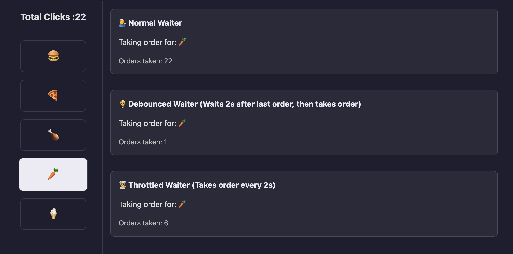

# Debounce and Throttle demo



# Understanding JavaScript Event Handlers

Event handlers are functions that execute when specific events (like clicks, typing, or scrolling) occur in JavaScript. By default, these handlers will fire every time the event happens - every keystroke, click, or scroll movement.

```jsx
// Basic event handler
button.addEventListener('click', function() {
    console.log('Button clicked!');
});

// Basic keystroke handler
input.addEventListener('keyup', function() {
    console.log('Key pressed!');
});
```

## Why we need Debounce and Throttle

Firing the handler on every single event can be inefficient. Example if your handler is making an API call on every keystroke thats something you might need to avoid. This is where **throttling** and **debouncing** come in to picture.

**Throttling** and **debouncing** are two most common ways to control an Event Listener’s response rate.

## Scenario

Say you have a button which would make an API call

```jsx
function makeApiCall() {
  console.log("API call made");
}

button.addEventListener('click', () => {
  makeApiCall();
});
```

The above function will execute the `makeApiCall()` function on each button click (i.e) if you manage to press it 10 times within 1 sec, guess what you have made 10 api calls in 1 sec. This is straight forward and default behaviour.

## Debouncing

I’m not going to explain the code for debouncing as this can just be used by importing from lodash, rather we will see how its actually used.

Use Debouncing when you want to make the api call only if the user has stopped typing for a certain amount of time or stopped clicking for a certain amount of time.

In our example if the user keeps clicking on the button even for 5 min straight, the api call will be made only once. 

So two things are happening here:
- User needs to stop clicking.
- Stop clicking means atleast for 2 seconds there should be no clicking on the button.

## Throttle

Throttle is like an interval. Use this when you dont want to wait till the user stops rather make an api call on every interval say 2 seconds

Example if the user is typing for 1 minute straight without pausing then for every 2 sec you would be calling the API.

## Restaurant Waiter Example
Suppose you go to a restaurant and orger food and just read out all the items in the menu then this is how the dffiernt waiters would behave

- Normal Waiter (default event handling): Takes order for every single item you read
- Debounce Waiter: When you start reading the menu he will be waiting for you to pause fot atleast 2 seconds before taking the order.
- Throttle: When you start reading the menu he will be taking order every 2 seconds.